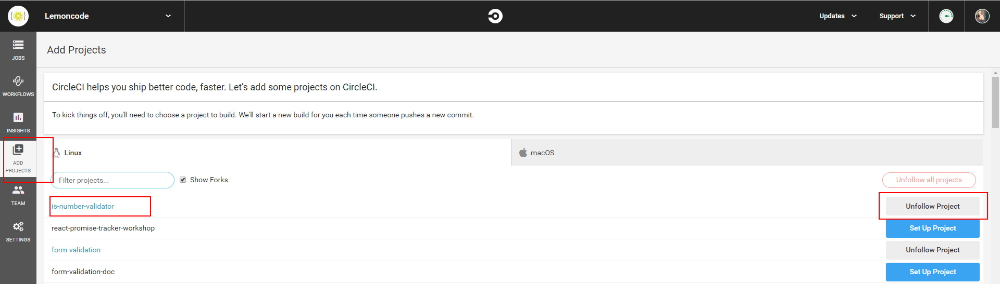

# fonk-validator-builder

Helper library to create `validators` supported by [fonk](https://github.com/Lemoncode/fonk) library.

# How to use it

- Install library as globally or use [npx](https://github.com/zkat/npx):

```bash
npm install @lemoncode/fonk-validator-builder -g
```

- Create validator repository in https://github.com/Lemoncode. A good repository name will be **fonk-_validator-name_-validator**. For example, `fonk-is-number-validator`.

- Add repository to [circleci](https://circleci.com/add-projects/gh/Lemoncode):



- Execute command in `empty` folder project. It will create validator folders and files:

```bash
fonk-validator
```

> NOTE: It will prompt a question requiring the `validator name`

- Install dependencies:

```bash
npm install
```

- Search `// TODO:` to get pending files to update and implement it:

- Add PR with implementation.

- Publishing library:

```bash
npm run deploy // Select library version 1.0.0
```

# Description

- Install as globally this library to create [fonk](https://github.com/Lemoncode/fonk) validators.
- Run `fonk-validator` command.
- Insert `validator name`. It automatically adds `fonk-` prefix and `-validator` suffix. For example: `is-number` -> `fonk-is-number-validator`.
- It will copy all necessary files in your project using the `validator name`.
- Now you can search `// TODO:` to implement necessary code.
- Publish new `fonk validator` with `npm run deploy`.

# About Basefactor + Lemoncode

We are an innovating team of Javascript experts, passionate about turning your ideas into robust products.

[Basefactor, consultancy by Lemoncode](http://www.basefactor.com) provides consultancy and coaching services.

[Lemoncode](http://lemoncode.net/services/en/#en-home) provides training services.

For the LATAM/Spanish audience we are running an Online Front End Master degree, more info: http://lemoncode.net/master-frontend
